# OpenWork Cloud PR1/PR2 Flow Evidence

This document captures the user-visible flows unlocked by PR1 + PR2:

1. Create a Den account from the Den web app.
2. Reach the new OpenWork Cloud surface from the OpenWork app.
3. Enable developer mode to target a local/self-hosted Den control plane.
4. Sign into OpenWork Cloud from the OpenWork app.
5. See Den workers in the app.
6. Open a Den worker into OpenWork.

What is not unlocked yet:

- org invite / join UI
- org member management UI
- GitHub marketplace / repo publishing

Those belong to later work and are not claimed by this PR pair.

## Flow 1 - Create a Den account in the Den web app

Environment used:

- `packaging/docker/den-dev-up.sh`
- captured against the Docker-hosted Den web app

### Step 1 - Landing on the Den signup page

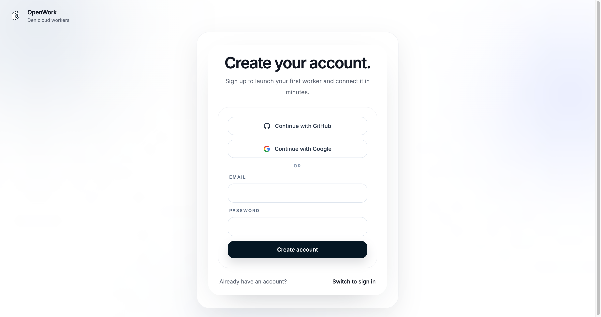

### Step 2 - Filling email and password

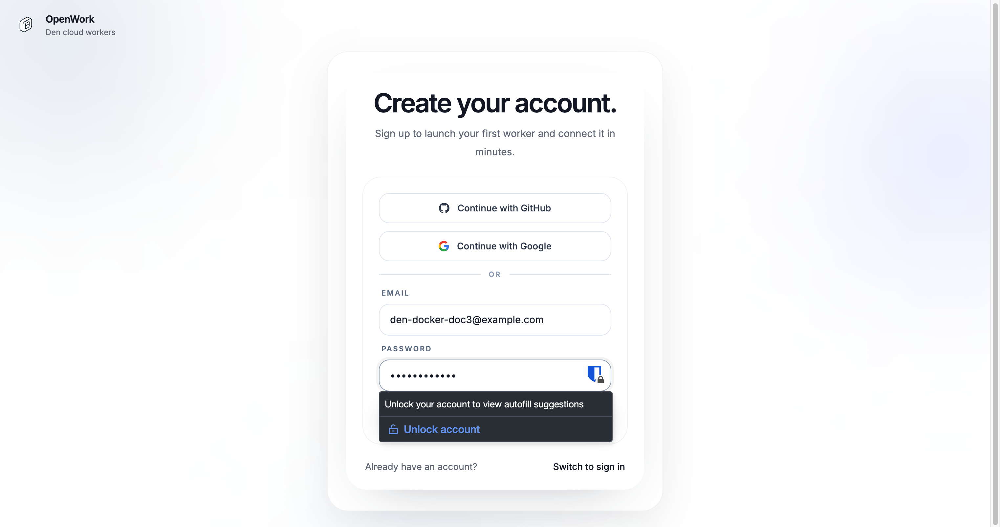

### Step 3 - Account created, worker naming step

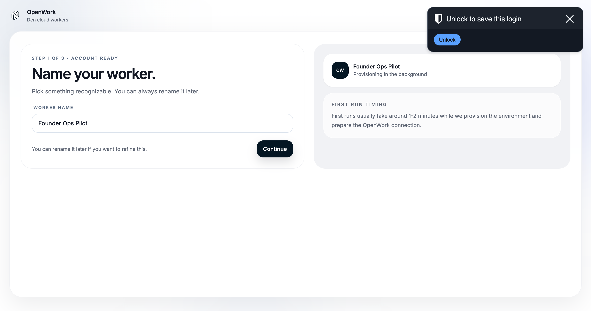

### Step 4 - Worker provisioning starts

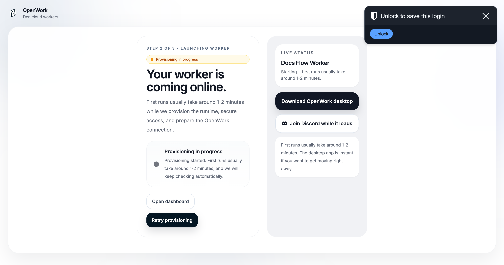

### Step 5 - Signed-in dashboard with the first worker

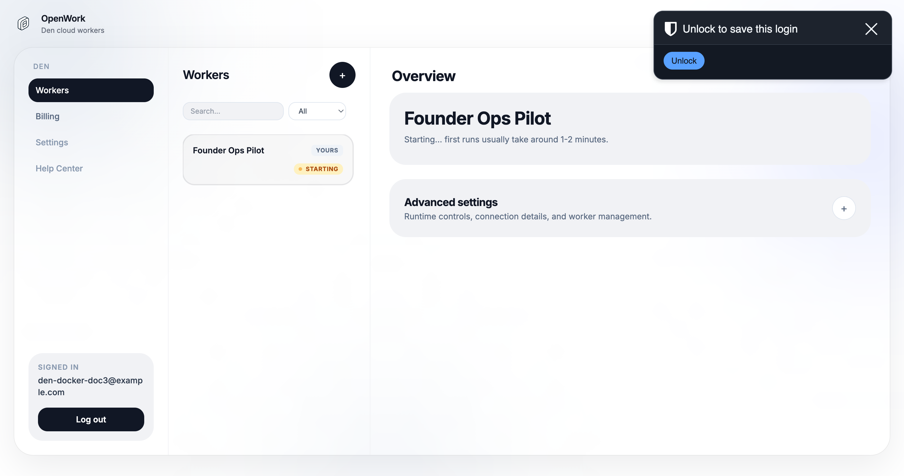

## Flow 2 - OpenWork app entry point for OpenWork Cloud

Environment used:

- `packaging/docker/dev-up.sh`
- captured against the Docker-hosted OpenWork app

### Step 1 - Default merged behavior points to hosted Cloud

This is the non-developer-mode experience after the latest adjustment. The app points to `https://app.openworklabs.com` and does not expose the Den endpoint override.

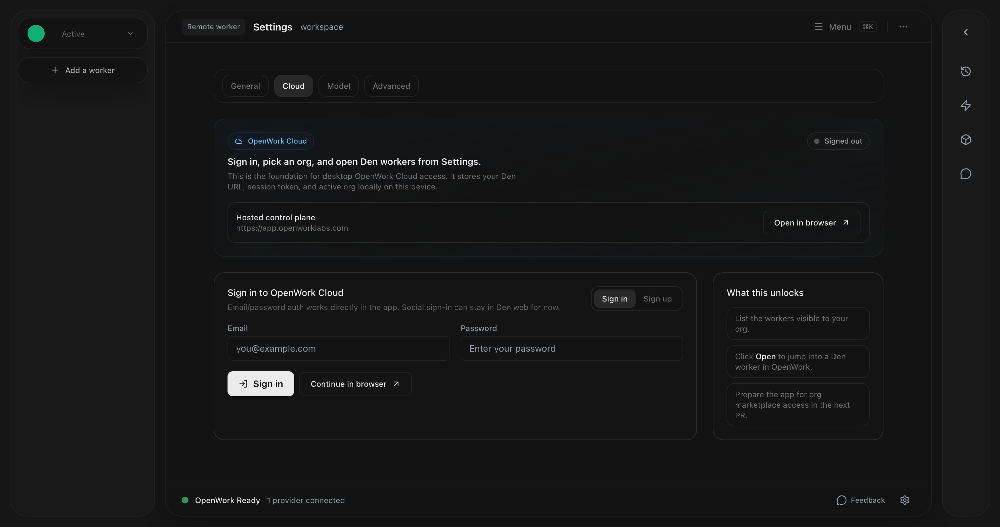

### Step 2 - Developer mode is off by default

Developer mode must be enabled before the Den endpoint override appears.

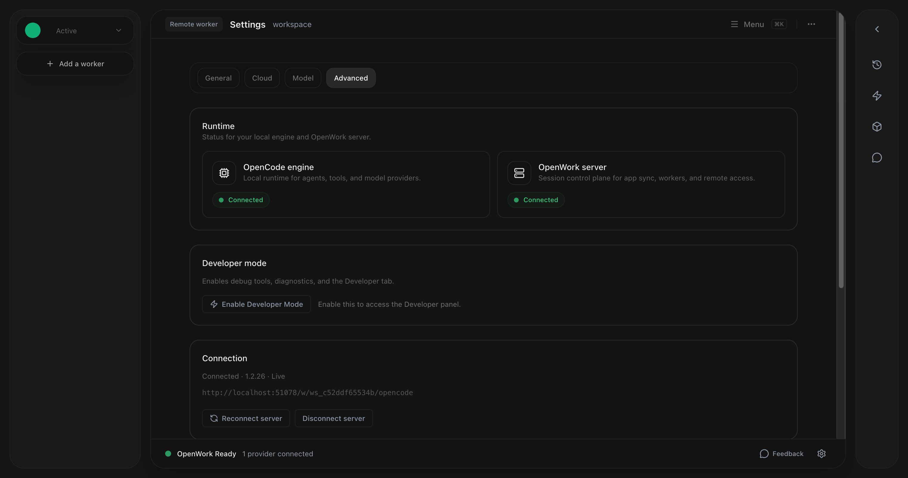

### Step 3 - Developer mode enabled

Once enabled, the Debug tab appears and the app can target a local or self-hosted Den control plane.

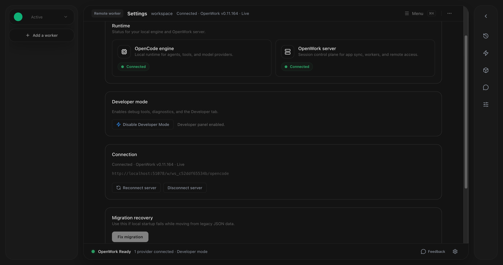

### Step 4 - Cloud tab with local Den override visible

This is the developer-mode-only Cloud screen used for local validation.

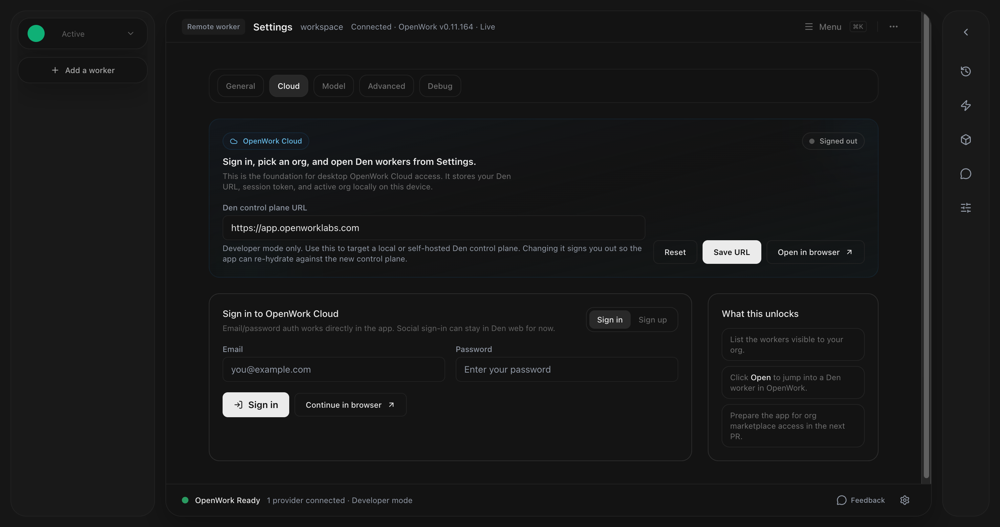

### Step 5 - Local Den endpoint plus credentials entered

This is the sign-in form used during local validation of the app-side flow.

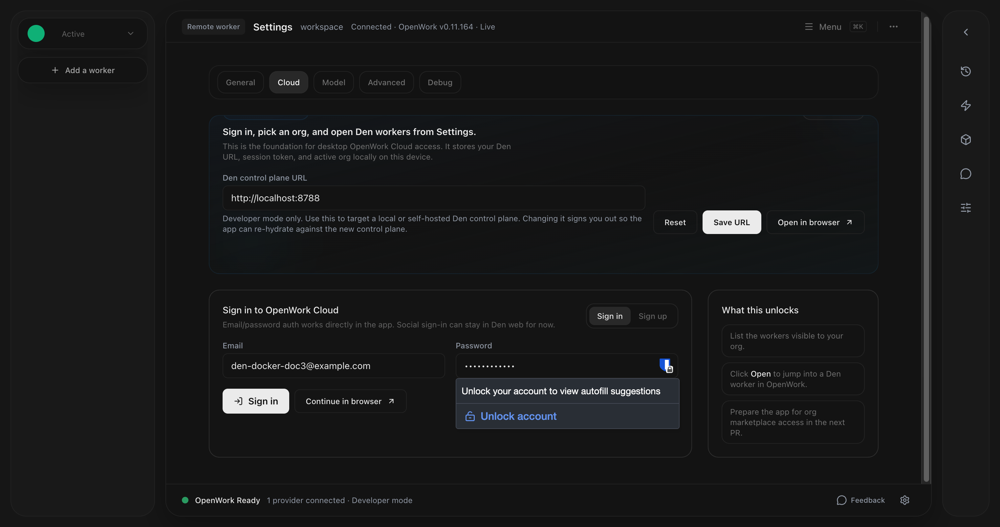

## Flow 3 - Signed into OpenWork Cloud, workers visible

Validation path:

- OpenWork app side validated in the Docker-hosted OpenWork app
- successful worker-list / worker-open proof captured from the same app surface against the Den-backed worker flow used in PR validation

### Step 6 - Signed in and worker list visible

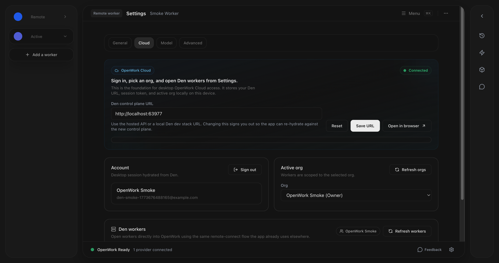

## Flow 4 - Open a Den worker inside OpenWork

### Step 7 - After clicking `Open`, the worker is active in OpenWork

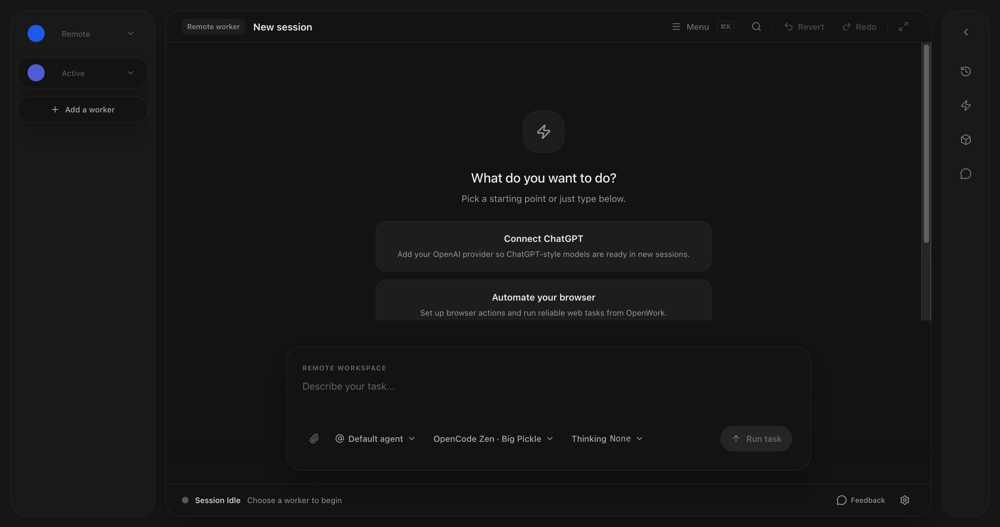

## Notes

- The OpenWork app screenshots prove the PR1/PR2 app behavior: Cloud tab, developer-mode endpoint override, sign-in, worker listing, and `Open`.
- The Den web screenshots prove account creation and first-worker initialization in the Docker Den stack.
- Org invite / join screenshots are intentionally absent because no invite/member-management UI ships in PR1/PR2.
